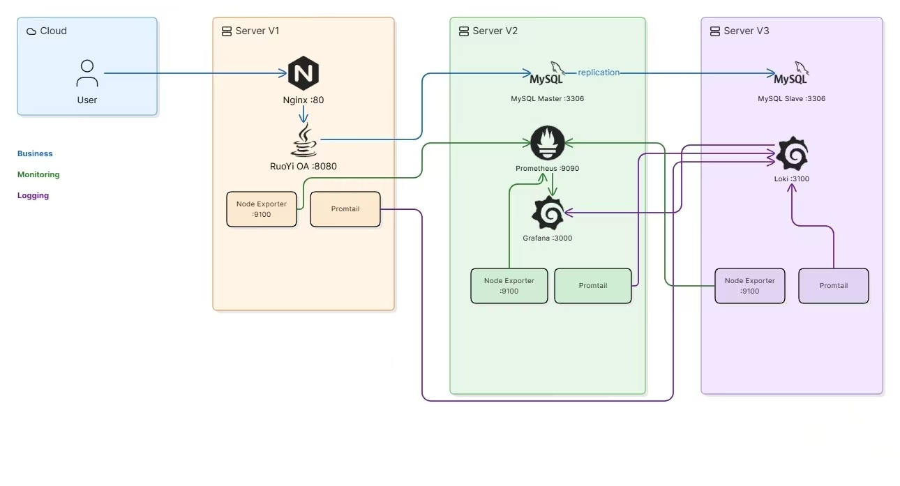
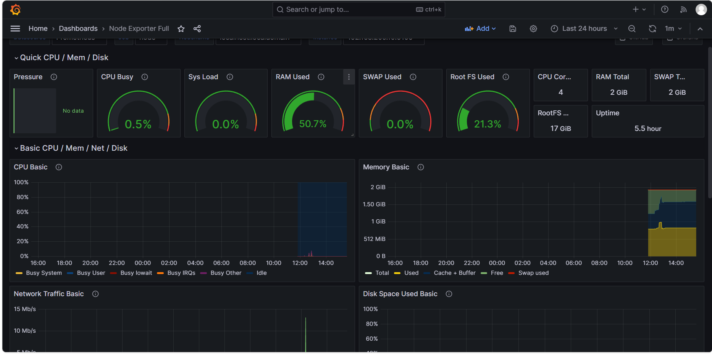
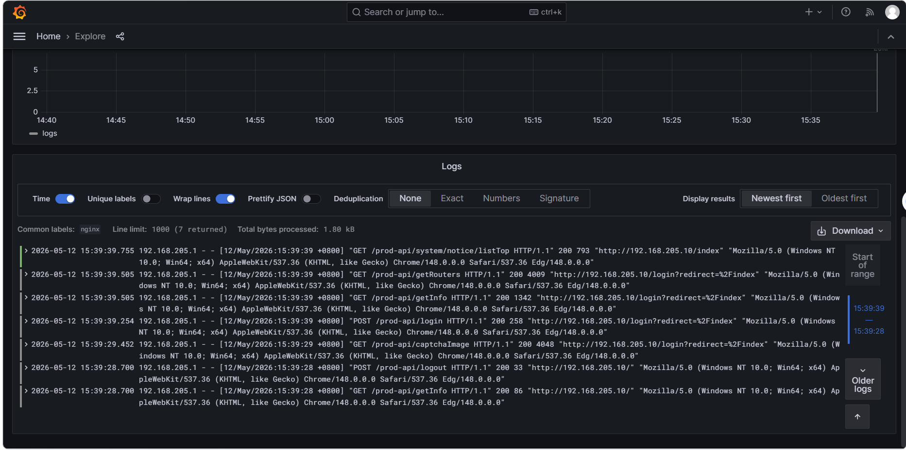
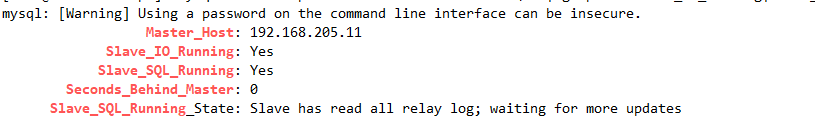

# 企业办公系统运维与监控平台

## 项目简介
独立搭建一套包含OA系统、数据库主从复制、监控告警、日志集中管理的企业级运维环境，
形成从部署、监控、日志到灾备的完整运维闭环。

## 技术栈
| 类别 | 技术 |
|------|------|
| 操作系统 | CentOS 7.9 |
| 应用服务 | 若依OA（SpringBoot + Vue3）+ Nginx |
| 数据库 | MySQL 5.7 主从复制 |
| 监控 | Prometheus + Grafana + Node Exporter |
| 日志 | Loki + Promtail |
| 脚本 | Shell（启停、备份、巡检自愈） |
| 安全 | firewalld + SELinux 策略 |

## 架构图


## 服务器拓扑
| 服务器 | IP | 角色 |
|--------|-----|------|
| V1 | 192.168.205.10 | 应用服务器（若依OA + Nginx） |
| V2 | 192.168.205.11 | 数据库主库 + 监控中心 |
| V3 | 192.168.205.12 | 数据库从库 + 日志中心 |

## 项目结构

​```
ops-platform/
├── README.md
├── arch.png
├── .gitignore
├── scripts/
│   ├── start.sh
│   ├── stop.sh
│   ├── mysql_backup.sh
│   └── check_app.sh
├── configs/
│   ├── prometheus.yml
│   ├── loki-config.yaml
│   ├── promtail-config.yaml
│   └── nginx.conf
├── docs/
│   ├── deployment-guide.md
│   └── troubleshooting.md
└── screenshots/
    ├── grafana-dashboard.png
    ├── loki-logs.png
    └── mysql-replication.png
​```

## 核心功能
- 若依OA系统的部署与Nginx反向代理
- MySQL主从复制，保障数据高可用
- Prometheus + Grafana 监控三台服务器CPU/内存/磁盘
- Loki + Promtail 集中采集Nginx和应用日志
- Shell脚本实现服务启停、数据库自动备份、故障自愈
- SELinux策略排障（经典502故障案例）

## 快速开始
详细的部署步骤请查看 [docs/deployment-guide.md](docs/deployment-guide.md)

## 故障案例
- [Nginx 502 — SELinux网络权限限制](docs/troubleshooting.md)

## 项目截图
| Grafana监控 | Loki日志 | MySQL主从 |
|:---:|:---:|:---:|
|  |  |  |

## 作者
ZX
